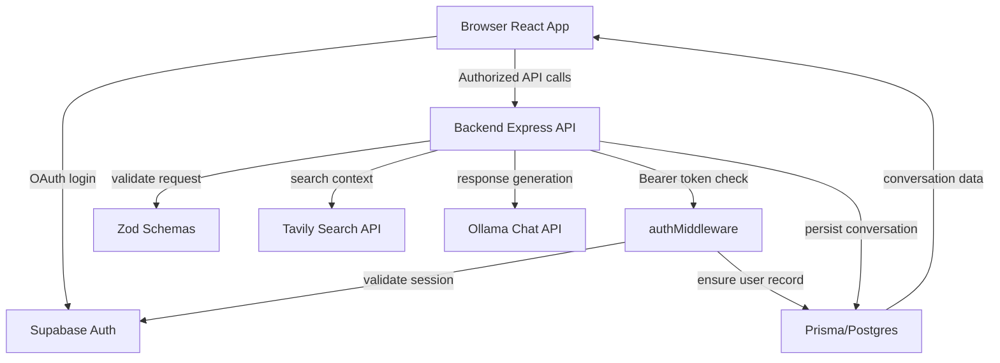

# aiSearch
**Authenticated AI Research Orchestration | Type-safe Search-to-Answer Pipeline**

A production-minded search assistant that combines type-safe session guarding, streaming AI response delivery, and contextual source provenance for authenticated research workflows.

---

## Key Architectural & Engineering Highlights

- **Type-safe end-to-end stack**
  - Full-stack TypeScript across frontend and backend.
  - Backend request contracts validated with `zod`.
  - Prisma schema-driven database models with generated client types.
  - Supabase session integration for token validation and user provenance.

- **Authentication + middleware guard**
  - Supabase OAuth login for Google and GitHub.
  - Backend `authMiddleware` validates bearer tokens and auto-provisions users in PostgreSQL.
  - Conversation access is protected by row-level ownership checks.

- **API contract design**
  - RESTful backend routes for conversation lifecycle and AI queries.
  - Strong request validation for query payloads, follow-up intent, pagination, and updates.
  - Axios interceptor on the frontend injects auth tokens automatically.

- **AI orchestration pipeline**
  - External search context fetched from Tavily.
  - Ollama chat model consumes search results and query context.
  - Streaming response pipeline reduces perceived latency and enables incremental client rendering.

- **Persisted conversational graph**
  - Conversation history persisted in Prisma/Postgres with `Users`, `Conversation`, and `Message` models.
  - Sources stored as structured arrays, enabling provenance and auditability.
  - Follow-up queries reconstruct history from DB for coherent multi-turn context.

- **Client-side data workflow**
  - React Router v7 protects authenticated routes.
  - Local React state manages query input, streaming assistant text, source cards, and follow-up suggestions.
  - Conversation history is loaded via a lightweight sidebar query.

- **Runtime & deployment choices**
  - Backend built on Bun for fast dev boot and runtime performance.
  - Express 5 powers REST endpoints with JSON body parsing and streaming support.
  - Minimal, maintainable architecture with explicit service boundaries.

---

## Tech Stack & Tools

- **Frontend**
  - React 19
  - Vite
  - React Router v7
  - Axios
  - Supabase JS

- **Backend**
  - Bun runtime
  - Express 5
  - Zod validation
  - Prisma ORM
  - Supabase SDK
  - Ollama client
  - Tavily search client
  - PostgreSQL driver (`pg`)

- **Database**
  - PostgreSQL
  - Prisma schema-driven models
  - UUID keys and strong relational typing
  - Array-backed source provenance storage

- **AI / ML Infrastructure**
  - Ollama cloud chat model (`minimax-m2.5:cloud`)
  - Tavily search API for query enrichment
  - Structured prompt output (`<TITLE>`, `<ANSWER>`, `<FOLLOW_UPS>`)

- **Auth & Security**
  - Supabase OAuth (Google, GitHub)
  - Bearer token validation in middleware
  - Ownership checks on every conversation access path

---

## Core Feature Walkthrough

- **Authenticated AI query workspace**
  - OAuth login with client-side auth state sync.
  - Protected `/ask` route only accessible after sign-in.

- **Contextual answer generation**
  - User queries are enriched with Tavily search results.
  - Search results and query text are streamed into Ollama.
  - Assistant answers are streamed back to the browser while still generating.

- **Conversation memory and follow-ups**
  - New conversations persist query, generated answer, and source URLs.
  - Follow-up requests rehydrate prior messages to maintain context.
  - Message history is stored chronologically and replayed on demand.

- **Source-backed provenance**
  - Source URLs are preserved on the conversation record.
  - Client-side UI normalizes and displays source hostnames and links.
  - Assistant responses include delineated source blocks for transparency.

- **History-first collaboration UX**
  - Sidebar history lists past conversations.
  - Selecting a conversation loads full thread and sources.
  - CRUD operations support rename and deletion with authorization enforcement.

---

## System Architecture / Data Flow



---

## Local Development Setup

1. Clone the repository

```bash
git clone <repo-url>
cd aiSearch
```

2. Install backend dependencies

```bash
cd backend
bun install
```

3. Install frontend dependencies

```bash
cd ../frontend
npm install
```

4. Configure environment variables

- Backend `.env`

```bash
SUPABASE_URL=...
SUPABASE_SECRET_KEY=...
TAVILY_API_KEY=...
AI_GATEWAY_API_KEY=...
```

- Frontend `.env`

```bash
VITE_SUPABASE_URL=...
VITE_SUPABASE_PUBLISHABLE_KEY=...
```

5. Start the backend and frontend

```bash
cd backend
bun --hot run index.ts
```

```bash
cd frontend
npm run dev
```

6. Open the UI at `http://localhost:5173`

---

